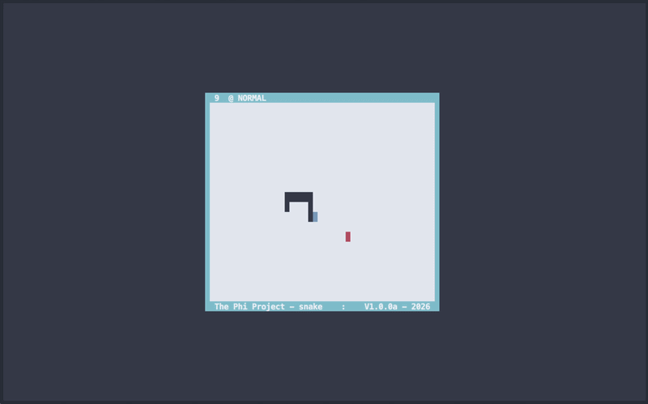

# SNAKE TERMINAL GAME
### Written in pure C using ncurses

---

Your terminal _must_ have at least 8-bit color. If enough people ask I'll make a black-and-white version.
The window must be at least 50x22 cells large.



---

# Installation
Grab a pre-compiled static binary over on the right if one matches your system.
There is also a [manpage](snake.6) for game rules as well as mode info.

### *nix (Ubuntu/Debian, OS X, Red Hat/Fedora, Arch)
```bash
# if you do not have ncurses installed...
#  Ubuntu/Debian: `apt install libncurses5-dev`
#  OS X has it preinstalled, otherwise: `brew install ncurses`
#  Red Hat/Fedora: `yum install ncurses-devel` OR `dnf install ncurses-devel`
#  Arch: `pacman -S ncurses`

git clone https://github.com/the-phi-project/snake
cd snake/
make

./snake
# if you choose, you could move the `snake` binary to /usr/bin/
# or /usr/local/bin/ to create a global binary, in which case
# you could omit the `./` above
```

### Windows
```bash
# COMING SOON!
```